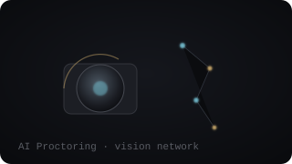
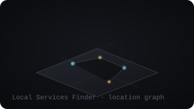
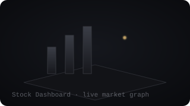

<h1>Hi, I'm Your Name 👋</h1>

<i>precision → intelligence → engineering → curiosity → craftsmanship</i>

## About Me

I build systems the way I'd want to inherit them — clear, deliberate, and built to last. My work sits at the intersection of applied AI, backend engineering, and product craft: things that need to be *correct* first, and interesting second.

- 🔭 Currently building AI-driven tools for real-world workflows
- 🌱 Deepening my work in applied ML systems and distributed backends
- 🧭 Interested in the quiet, unglamorous engineering that makes systems trustworthy
- 💬 Ask me about model evaluation, systems design, or developer tooling

 

  

## Featured Projects

<table>
<tr>
<td width="33%" valign="top">

**AI Proctoring**
Real-time monitoring system using a lightweight vision network for identity and attention verification.

`Python` `OpenCV` `PyTorch`

</td>
<td width="33%" valign="top">

**Local Services Finder**
A geo-aware discovery platform connecting users to nearby services through a live location graph.

`Node.js` `PostGIS` `React`

</td>
<td width="33%" valign="top">

**Stock Dashboard**
A real-time market dashboard that turns streaming price data into a calm, readable visual surface.

`TypeScript` `WebSockets` `D3`

</td>
</tr>
</table>

  

## Tech Stack

  

## GitHub Stats

  

## Connect

Every element above is a hand-authored, dependency-free SVG — no JavaScript, no WebGL, no external animation service. If a viewer doesn't support the motion, each file still reads as a clean, intentional static graphic.

